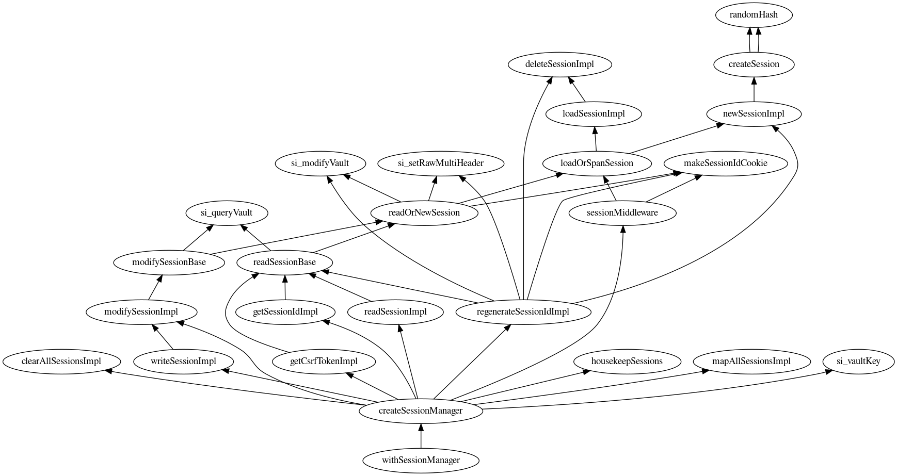
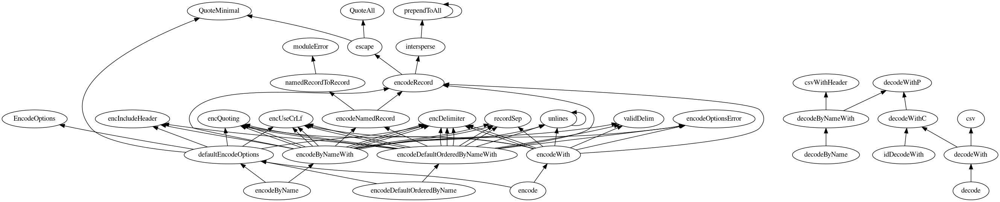

# indextool

Disclaimer: Highly experimental and non-production code, rather for inspiration
than for depending on it.

Inspired by [/r/Darwin226's question](https://www.reddit.com/r/haskell/comments/6x69bf/haskellindexer_crossreferenced_codebase_for/dmdk9wn/).

## Usage

Can be used to render the callgraph of top-level entities of a file. To get
the entities index, use
[haskell-indexer](https://github.com/google/haskell-indexer).
For example, running on a Stackage LTS 9.2 index:

```
$ cat indexing/Spock-0.12.0.0.entries | /opt/kythe/tools/entrystream --unique | /opt/kythe/tools/triples - | gzip > /tmp/triples.nq.gz
2017/09/01 22:36:15 Skipped 0 reverse edges
2017/09/01 22:36:15 Wrote 15871 triples
```

Download the [Cayley](http://cayley.io) graph database, and start serving the
extracted triples:

```
$ ./cayley http --dbpath /tmp/triples.nq.gz --host 0.0.0.0
Cayley now listening on 0.0.0.0:64210
```

Navigate to that port to verify that it's running, the build and run the
indextool:

```
stack build
stack exec -- indextool-exe "kythe:?path=Spock-0.12.0.0/src/Web/Spock/Internal/SessionManager.hs" > graph.dot
```

Finally visualize the graph with the `graphviz` utility:

```
dot graph.dot -Tpng -o graph.png
display graph.png
```
This produces the [following graph file](example/graph.dot), and the rendered
image:



## Missing links

For that usecase (topological sorting the module callgraph) it would be useful
to add to the graph the child relations of data structures / typeclasses, since
a refactoring doesn't split those up usually (though it's not forbidden). But
the emitted Kythe index doesn't have that data yet (see
https://github.com/google/haskell-indexer/issues/11).

A render, randomly made of a `cassava` module, illustrates this. In the image
below, `QuotaAll` and `QuoteMinimal` are constructors of the same type, but
this doesn't show in the graph.



